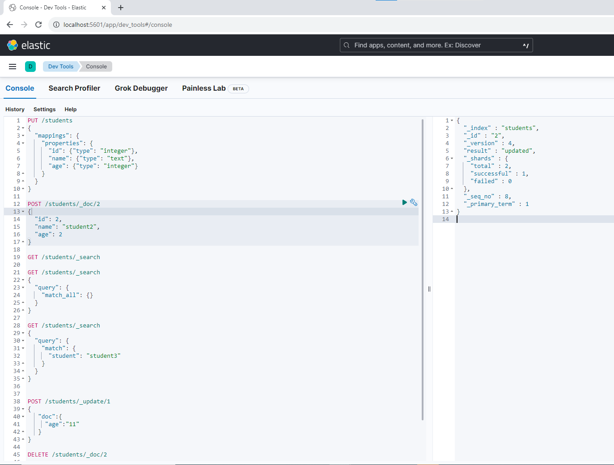
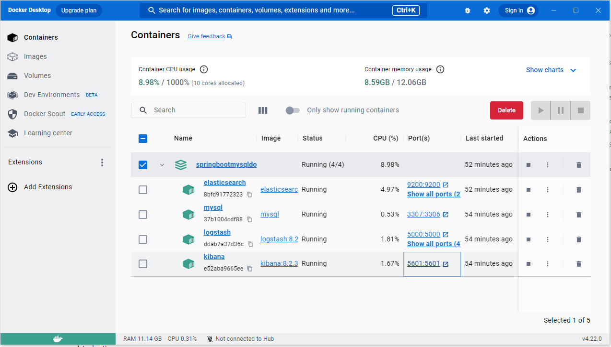
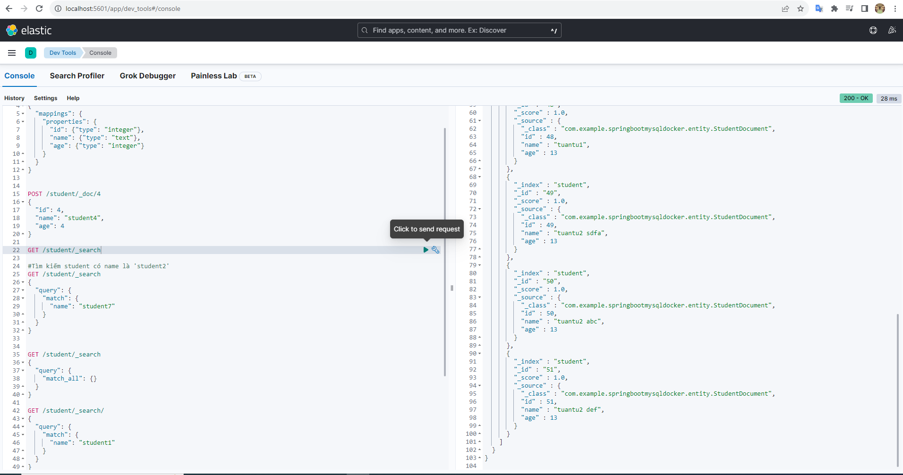
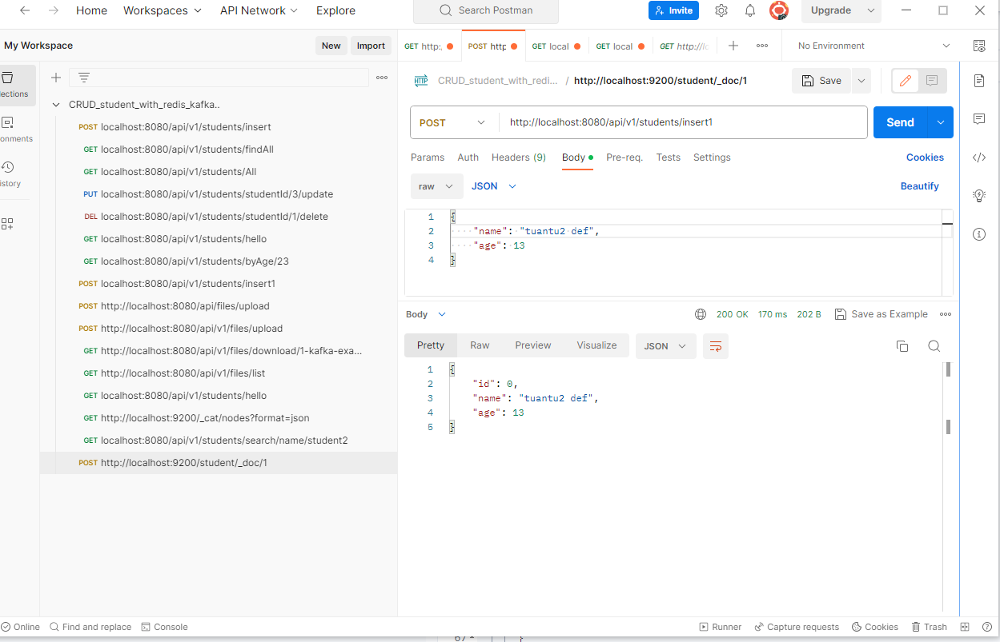
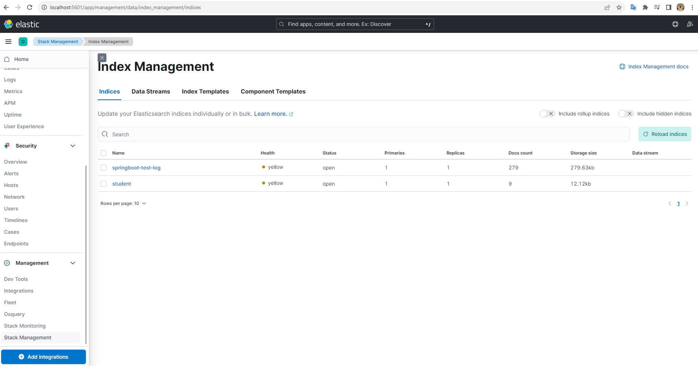
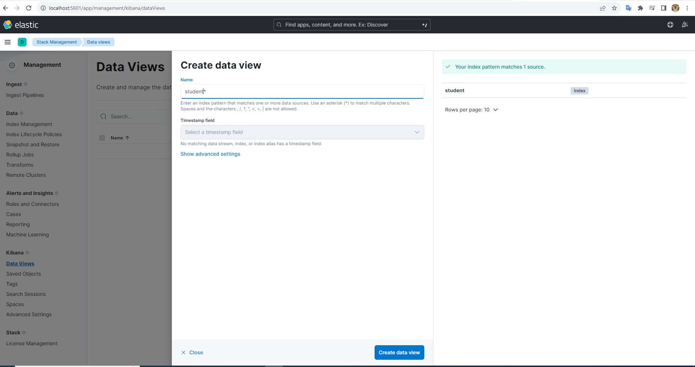
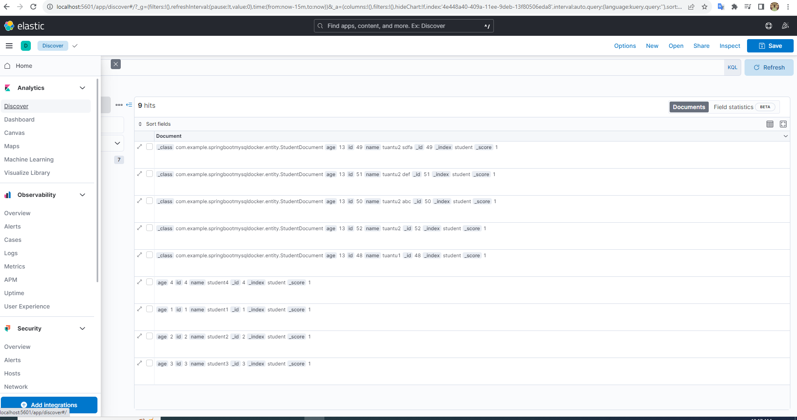

## Các công cụ phần mềm sử dụng trong project:

- Inteliji
- postman
- mysql
- cmd
- elasticserch
- kibana
- logstash

## Cách ứng dụng redis trong project?


## Elasticsearch REST APIs 
Ta có thể xem trực quan qua Cách CRUD index sau:




## Thực hành Java Spring Boot + Elasticsearch + kibana + Logstash (ELK)
### Bước 1: Cấu hình pom.xml, application.propertiesvà thêm thư viện cho elasticsearch 

+ pom.xml
```bash
     <!--        elasticsearch  -->
        <dependency>
            <groupId>org.springframework.boot</groupId>
            <artifactId>spring-boot-starter-data-elasticsearch</artifactId>
        </dependency>
     <!--        logstash  -->
        <dependency>
            <groupId>net.logstash.logback</groupId>
            <artifactId>logstash-logback-encoder</artifactId>
            <version>7.2</version>
        </dependency>
```

```bash

  #C?u hình elasticsearch
spring.data.elasticsearch.cluster-names=docker-cluster
spring.data.elasticsearch.cluster-node=localhost:9200
spring.data.elasticsearch.repositories.enabled=true  #spring boot sẽ tự động tạo repository cho elasticsearch
spring.data.elasticsearch.auto-index-creation=true  #spring boot sẽ tự động tạo index cho elasticsearch

```

- Cấu hình docker-compose cho elasticsearch, kibana và logstash

```bash

  elasticsearch:
    image: elasticsearch:8.2.3
    container_name: elasticsearch
    environment:
      - xpack.security.enabled=false
      - discovery.type=single-node
    ulimits:
      memlock:
        soft: -1
        hard: -1
      nofile:
        soft: 65536
        hard: 65536
    cap_add:
      - IPC_LOCK
    volumes:
      - ./elasticsearch/data:/usr/share/elasticsearch/data
    ports:
      - 9200:9200
      - 9300:9300

 # Giải thích :
 # - xpack.security.enabled=false: Tắt tính năng bảo mật X-Pack của Elasticsearch.
 # - discovery.type=single-node: Đặt kiểu phát hiện thành "single-node", chỉ định rằng Elasticsearch đang chạy trong môi trường đơn lẻ.
 # ulimits: Đây là cấu hình giới hạn tài nguyên cho container:
 # memlock: Giới hạn bộ nhớ khóa.
 # nofile: Giới hạn số file mở.
 # cap_add: Đây là danh sách các quyền cấp (capabilities) được thêm vào cho container
 # Cổng 9200 trên máy host sẽ được chuyển tiếp vào cổng 9200 trong container, cho phép truy cập đến REST API của Elasticsearch.
 # Cổng 9300 trên máy host sẽ được chuyển tiếp vào cổng 9300 trong container, cho phép giao tiếp giữa các nút Elasticsearch trong môi trường phân 

  kibana:
    container_name: kibana
    image: kibana:8.2.3
    environment:
      - ELASTICSEARCH_HOSTS=http://elasticsearch:9200
    ports:
      - 5601:5601
    depends_on:
      - elasticsearch

  logstash:
    image: logstash:8.2.3
    container_name: logstash
    volumes:
      - ./logstash/config/logstash.yml:/usr/share/logstash/config/logstash.yml:ro
      - ./logstash/pipeline:/usr/share/logstash/pipeline:ro
    ports:
      - 5044:5044
      - 5000:5000/tcp
      - 5000:5000/udp
      - 9600:9600
    environment:
      LS_JAVA_OPTS: "-Xmx256m -Xms256m"
    depends_on:
      - elasticsearch

  # giải thích:
  # ro: (read-only)   
  # LS_JAVA_OPTS: "-Xmx256m -Xms256m": Đây là các tùy chọn JVM (Java Virtual Machine) được cấu hình cho Logstash. 
  # Trong trường hợp này, Logstash sẽ sử dụng tối đa 256MB bộ nhớ và có thể sử dụng tối thiểu 256MB bộ nhớ.  

```
### Bước 2: chạy docker-compose sử dụng lệnh : $ docker-compose up


### Bước 3 : thực hành với elasticsearch + kibana + logstash
+ Tiếp phần trước khi tương tác CRUD student với mysql 
+ trong code sẽ thêm save student object và search list student theo tên tương tác với kibana UI 
+ Đầu tiên với controller 
```bash
      // insert student elasticsearch
    @PostMapping("/insert1")
    StudentEntity insertStudent1(
            @RequestBody @Validated Student student) {
        return studentService.insertStudent1(student);
    }

    // search name elasticsearch
    @GetMapping("/search/name/{keyword}")
    public List<StudentDocument> searchStudentName(@PathVariable String keyword) {
        return studentService.findStudentByName(keyword);
    }
```
+ Do khi thực hiện truy vấn hay kết quả trả về sẽ là 1 Modeldocument nên mình tạo ra thêm 1 object StudentDocument với index là 'student'

```bash
  @AllArgsConstructor
  @NoArgsConstructor
  @Data
  @Document(indexName = "student")
  public class StudentDocument {
    private int id;
    private String name;
    private int age;
}

```
+ Tầng service
```bash
public StudentEntity insertStudent1(Student student) {
        String message = "insert student failed!";
        try {
            StudentEntity savedStudent = studentRepository.save(studentConverter.toEntity(student));
            StudentDocument s = new StudentDocument(savedStudent.getId(), student.getName(), student.getAge());
            studentRepositoryElasticsearch.save(s);
            message = "Add an employee successfully!";
            log.info(message);
        } catch (Exception e) {
            log.error(e.getMessage());
        }
        return studentConverter.toEntity(student);
    }

    public List<StudentDocument> findStudentByName(String keyword) {
        log.info("find student by name: "+ keyword);
        return studentRepositoryElasticsearch.findStudentByName(keyword);
    }

    giải thích: khi save 1 object lưu trữ trên elasticsech với index(table) trên kibana chúng ta sẽ thông qua studentRepositoryElasticsearch như là 1 
    repository bình thường nhưg khi save object sẽ là 1 studentDocument với index là student
```
+ tầng repository
+ Muốn tương tác được với elasticsearch kibana thì ta phải sử dụng repo của nó chúng ta cần tạo 1 repository extends từ
ElasticsearchRepository mà kết quả trả về hay tham số truyền vào sẽ là 1 modelDocument như trong code mình là StudentDocument

```bash
  @Qualifier("studentRepositoryElasticsearch")
  public interface StudentRepositoryElasticsearch extends ElasticsearchRepository<StudentDocument, Long> {
    @Query("{\"match\": {\"name\": \"?0\"}}")
    List<StudentDocument> findStudentByName(String name);
}
```
Giải thích: khi sử dụng res api với kibana sẽ tương tác với kibana sẽ như sau:
```bash
  GET /student/_search
  {
    "querry":{
      "match": {
        "name": "tuantu3"
      }
    }
  }

  Kết quả sẽ trả ra 1 list student có tên là name = 'tuantu3' khi tương tác với UI kibana 
```
+ Khi sử dụng với repo thì ta sẽ biến đổi query tương tự với câu lệnh restAPI get dữ liệu với kibana

```bash
 @Query("{\"match\": {\"name\": \"?0\"}}")
```




+ Tiếp theo sẽ kiểm tra kết quả thông qua postman và UI kibana 
 - Sử dụng postman để save và search student theo name theo api sau:

 

 ```bash
  + Với save student :
  http://localhost:8080/api/v1/students/insert1

  Json: 
  {
    "name": "tuantu3 àfdsà ewqdf",
    "age": 13
  }

  + Với search student:
  localhost:8080/api/v1/students/search/name/tuantu3
  
 ```

 sau khi thực hiện xong sẽ kiểm tra trên kibana xem kết quả như hình sau:
<!--  -->

## Thực hành và kiểm tra với Logstash
+ Với logstash sẽ ghi lại hiển thị log trực quan giúp ta phân tích rõ hơn 
* trong code tạo log sử dụng trong service nếu student save thành công thì sẽ báo thong tin cũng như get 1 student theo name
```bash
      public StudentEntity insertStudent1(Student student) {
        String message = "insert student failed!";
        try {
            StudentEntity savedStudent = studentRepository.save(studentConverter.toEntity(student));
            StudentDocument s = new StudentDocument(savedStudent.getId(), student.getName(), student.getAge());
            studentRepositoryElasticsearch.save(s);
            message = "Add an employee successfully!";
            log.info(message);
        } catch (Exception e) {
            log.error(e.getMessage());
        }
        return studentConverter.toEntity(student);
    }

    public List<StudentDocument> findStudentByName(String keyword) {
        log.info("find student by name: "+ keyword);
        return studentRepositoryElasticsearch.findStudentByName(keyword);
    }
```

* trên giao diện của kibana chúng ta vào management 


+ tạo 1 Dataview như của mình tạo student như tên table và spring-test-log minh họa


+ truy cập xem log discovery


+ Sau khi truy cập vào xong chúng ta sẽ xem được như trên sẽ là student xem log và thống kê


+ Xem thống kê biểu đồ


như ảnh sau... 
và phân tích có thể nhìn thấy thông qua sơ đồ phân tích và log sẽ ghi lại tất cả những api nào đã được gọi và thống 
kê tất cả những thông tin nào tên nào search nhiều nhất...

Thank for watch ^^ source code sau: http://10.60.156.11/khcp/daotao/tuansv/elasticsearch


