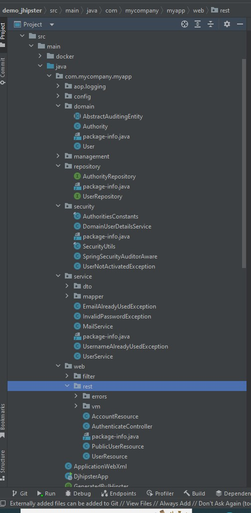
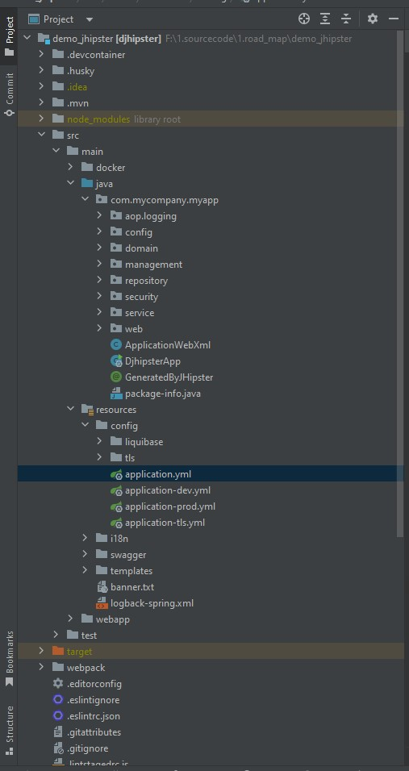

## In this article
* [Overview](#overview)
* [JHipster là gì?](#jhipster-là-gì)
* [Tổng quan về Project đã tạo](#tổng-quan-về-project-đã-tạo)
* [Back-end Files](#back-end-files)
* [Front-end ](#front-end)
* [Tạo các entity tùy chỉnh](#tạo-các-entity-tùy-chỉnh)
* [Hỗ trợ tích hợp liên tục](#hỗ-trợ-tích-hợp-liên-tục)

## Overview
  Bài viết này sẽ cung cấp cái nhìn tổng quan về JHipster, hướng dẫn bạn cách tạo một ứng dụng đơn giản và các thực thể tùy chỉnh bằng cách sử dụng các công cụ dòng lệnh. Chúng ta cũng sẽ kiểm tra mã được tạo trong mỗi bước và cũng bao gồm các lệnh xây dựng và kiểm tra tự động.

## JHipster là gì?
JHipster( viết tắt của Java Hipster) là cách đơn giản để chúng ta tạo ra một project xung quanh những công nghệ được ưa thích nhất với Spring technologies và Angular/React.

**3 Khía cạnh nên quan tâm khi bắt đầu dự án:**
 - Server side
 - client side
 - deployment

### Server side
+ **Ngôn ngữ lựa chọn là gì?**
    JHipster hỗ trợ cả Java và Kotlin làm ngôn ngữ lập trình cho phía máy chủ. 

+ **Dữ liệu sẽ như thế nào?**
   JHipster hỗ trợ nhiều loại cơ sở dữ liệu như MySQL, PostgreSQL, MongoDB, và nhiều loại khác.

+ **Hệ thống sẽ bảo mật ra sao?**
   JHipster có tích hợp sẵn cơ chế bảo mật với Spring Security để quản lý xác thực người dùng và quyền truy cập.

+ **Khả năng bảo trì và mở rộng hệ thống?**
   JHipster sử dụng kiến thức cơ bản của Spring Boot để xây dựng ứng dụng, giúp bạn có được một kiến trúc tốt cho việc bảo trì và mở rộng. Sử dụng các tiêu chuẩn và mẫu thiết kế tốt, JHipster giúp tạo ra mã nguồn dễ bảo trì và mở rộng.

+ **Cách cung cấp API document?**
   JHipster cung cấp tích hợp sẵn cho Swagger (OpenAPI) để tạo tài liệu API tự động. Khi bạn xây dựng các endpoint API, tài liệu sẽ được tạo ra tự động và bạn có thể truy cập vào đó để kiểm tra và thử nghiệm API của ứng dụng.

+ **Kiểm thử ứng dụng thế nào?**
   JHipster cung cấp khung kiểm thử tích hợp. Bạn có thể sử dụng các thư viện kiểm thử như JUnit và Testcontainers

  

### Client-site
+ JHipster cung cấp sự hỗ trợ cho các framework frontend mạnh mẽ như Angular và React.

### Deployment
+ **JHipster** cung cấp nhiều tùy chọn để triển khai dự án của bạn một cách dễ dàng trên nhiều môi trường khác nhau. 

 + **Triển khai local:** Có thể triển khai ứng dụng JHipster trên máy tính cá nhân để kiểm tra và thử nghiệm Bằng cách sử dụng các lệnh được cung cấp bởi JHipster CLI, bạn có thể chạy ứng dụng trên máy chủ local của mình để xem kết quả.
 + **Triển khai lên máy chủ từ xa:** JHipster cho phép bạn triển khai ứng dụng lên các máy chủ từ xa thông qua các công cụ quản lý dự án như Maven hoặc Gradle.

 + **Triển khai trên các dịch vụ đám mây:** JHipster cung cấp hỗ trợ cho nhiều dịch vụ đám mây phổ biến như AWS, Google Cloud, Azure và nhiều dịch vụ khác.
 + **Sử dụng Docker:** Docker là một cách tốt để đóng gói ứng dụng và triển khai chúng trên các môi trường khác nhau một cách đáng tin cậy. JHipster hỗ trợ việc tạo các Docker image để triển khai ứng dụng trên các container Docker.
 + **Triển khai tự động:** JHipster có khả năng tích hợp liên kết với các dịch vụ triển khai tự động như Jenkins, Travis CI, hoặc GitLab CI/CD. 

 

## Tổng quan về Project đã tạo
  + Hãy xem các tệp được tạo tự động. Bạn sẽ nhận thấy rằng dự án trông khá giống một dự án Java / Spring tiêu chuẩn, nhưng có rất nhiều tính năng bổ sung.
  + Vì JHipster cũng đảm nhận việc tạo mã giao diện người dùng nên bạn sẽ tìm thấy tệp package.json, thư mục webpack và một số nội dung liên quan đến web khác.

## Back-end Files và Front-end

      

+ Như hình minh họa code Java được chứa trong thư mục src/main/java 
+ Thư mục src/main/resources có một số nội dung tĩnh được sử dụng bởi mã Java. Tại đây sẽ tìm thấy các tệp đa ngôn ngữ (trong thư mục i18n), các mẫu email và một số tệp cấu hình.
+ test và tích hợp nằm trong thư mục src / test / java.
+ trong phần src/main/java/resources/tls phần thành 2 môi trường : 
    - Develop
    - Production
  + File application chạy chung cho 2 môi trường này.

+ Thư mục giao diện người dùng gốc là src/main/webapp
+ Thư mục app chứa nhiều mô-đun React
+ i18n chứa các tệp đa ngôn ngữ cho phần giao diện người dùng
+ Unit tests (Karma) nằm trong thư mục src/test/javascript/spec
+ End-to-end tests (Protractor) nằm trong thư mục src/test/javascript/e2e

Tác giả: [Nguyễn Anh Tuấn](https://github.com/FPTooHenry)

