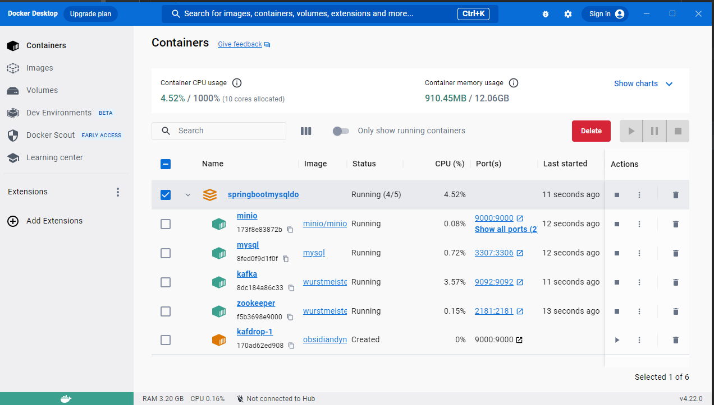
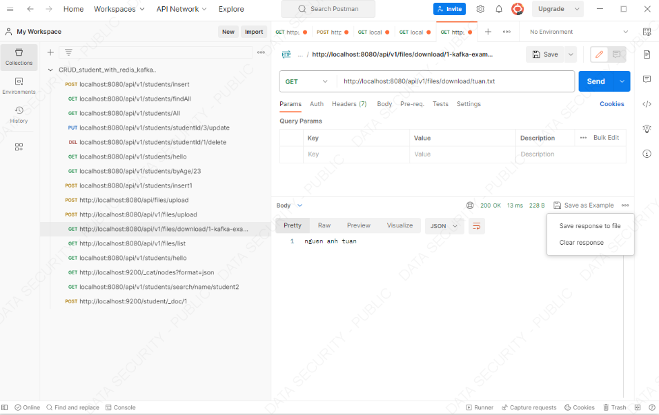

## Các công cụ phần mềm sử dụng trong project:

- Inteliji
- postman
- MinIO UI

### Bước 1: Cấu hình pom.xml và application.properties

- Với pom.xml thì ta thêm thư viện sử dụng cho minIO

```bash
           <!--minIO-->
        <dependency>
            <groupId>io.minio</groupId>
            <artifactId>minio</artifactId>
            <version>8.1.0</version>
        </dependency>
```

- Tiếp theo cấu hình minIO trong application.properties

```bash
# Cấu hình MinIO
spring.minio.url=http://localhost:9000
spring.minio.access-key=minio_access_key
spring.minio.secret-key=minio_secret_key

# Cấu hình Multipart
#Bật tích hợp xử lý tệp tin đa phần.
spring.servlet.multipart.enabled=true
spring.servlet.multipart.max-file-size=10MB
spring.servlet.multipart.max-request-size=10MB

```

### Bước 2: Thiết lập tạo file docker-compose để chạy và triển khai các container

- Tạo file docker-compose

```bash
    minio:
    image: minio/minio:latest
    container_name: minio
    environment:
      - MINIO_ROOT_USER=minio_root
      - MINIO_ROOT_PASSWORD=minio_root
      - MINIO_ACCESS_KEY=minio_access_key
      - MINIO_SECRET_KEY=minio_secret_key
    volumes:
      - ./minIO/data:/data
    ports:
      - 9000:9000
    command: server /data --console-address ":9001"
#    run minIO
```

- Sau khi tạo xong docker-compose sử dụng terminal trong thư mục đó chạy container

```bash
  gõ lệnh: $docker-compose up
  (lưu ý: $docker-compose down để xóa hết container cũ)
```

- Kiểm tra docker run success minh họa sau :



### Bước 3: ÁP dụng và kiểm tra tương tác minIO

- Ta có thể kiểm tra trực quan giao diện của minIO:


- Đầu tiên ta cần tạo file configuration để tương tác với minIO

```bash
@Configuration
public class MinioConfiguration {

    @Value("${spring.minio.url}")
    private String endpoint;

    @Value("${spring.minio.access-key}")
    private String accessKey;

    @Value("${spring.minio.secret-key}")
    private String secretKey;

    @Value("${minio.bucket-name}")
    private String bucketName;

    @Bean
    public MinioClient getMinioClient() {
        return MinioClient.builder()
                .endpoint(endpoint)
                .credentials(accessKey, secretKey)
                .build();
    }

    public String getBucketName() {
        return bucketName;
    }
}
```

- trong project ta sẽ push 1 object với bucket tên là student và sẽ get object về từ minIO điển hình nhất là upload 1 tệp file or là image và lấy object của chúng về

- Với controller:

```bash
 tạo class FileController
 @RestController
@RequestMapping("/api/v1/files")
public class FileController {

    @Autowired
    private FileService fileService;

    @PostMapping("/upload")
    public ResponseEntity<String> uploadFile(@RequestParam("file") MultipartFile file) {
        String fileName = fileService.uploadFile(file);
        if (fileName != null){
            return ResponseEntity.ok("File " + fileName + " uploaded successfully.");
        }
        else {
            return ResponseEntity.badRequest().body("Failed to upload file.");
        }
    }

    @GetMapping("/download/{fileName:.+}")
    public ResponseEntity<Resource> downloadFile(@PathVariable String fileName) {
        Resource resource = fileService.downloadFile(fileName);
        return ResponseEntity.ok()
                .header("Content-Disposition", "attachment; filename=\"" + resource.getFilename() + "\"")
                .body(resource);
    }

    @GetMapping("/list")
    public List<String> listMinioObjects() {
        return fileService.listFiles();
    }
}

  trong các api trên sẽ upload 1 object , download object và list object như code tên tôi để là File
```

- Tầng service

```bash
  @Service
  public class FileService {

    @Autowired
    private MinioClient minioClient;

  //    @Autowired
  //    private MinioConfiguration minioConfiguration;

    public String uploadFile(MultipartFile file) {
        try (InputStream is = file.getInputStream()) {
            String fileName = StringUtils.cleanPath(file.getOriginalFilename());
            System.out.println("fileName: " + fileName);
            minioClient.putObject(PutObjectArgs.builder()
                    .bucket("my-bucket")
                    .object(fileName)
                    .stream(is, is.available(), -1)
                    .contentType(file.getContentType())
                    .build()
            );
            return fileName;
        } catch (IOException | MinioException | InvalidKeyException | NoSuchAlgorithmException e) {
            // Handle exceptions
            System.out.println("fileName: ");
        }
        return null;
    }

    public Resource downloadFile(String fileName) {
        try {
            InputStream stream = minioClient.getObject(
                    GetObjectArgs.builder()
                            .bucket("my-bucket")
                            .object(fileName)
                            .build());
            if (stream != null) {
                return new InputStreamResource(stream);
            } else {
                return null;
            }

        } catch (IOException | MinioException | InvalidKeyException | NoSuchAlgorithmException e) {
            // Handle exceptions
            System.out.println("exception download file: " + e);
        }
        return null;
    }

    public List<String> listFiles() {
        List<String> objectNames = null;
        try {
            Iterable<Result<Item>> results = minioClient.listObjects(
                    ListObjectsArgs.builder()
                            .bucket("my-bucket")
                            .build());

            // Thư mục đích để lưu các đối tượng trên máy
            String downloadPath = "F:/1.sourcecode/1.road_map/6.minIO\\SpringbootMYSQLDocker/file_object_minio";
            objectNames = new ArrayList<>();
            for (Result<Item> result : results) {
                objectNames.add(result.get().objectName());
                String destFilePath = downloadPath + "/" + objectNames;


                // Tạo đối tượng GetObjectArgs
                GetObjectArgs getObjectArgs = GetObjectArgs.builder()
                        .bucket("my-bucket")
                        .object(result.get().objectName())
                        .build();


                // Tải xuống đối tượng và lưu vào máy
                InputStream stream = minioClient.getObject(getObjectArgs);
                Files.copy(stream, Paths.get(destFilePath), StandardCopyOption.REPLACE_EXISTING);
                System.out.println("Downloaded: " + result.get().objectName());

            }
            System.out.println("Downloaded all object: " + objectNames);

        } catch (IOException | MinioException | InvalidKeyException | NoSuchAlgorithmException e) {
            // Handle exceptions
        }
        return objectNames;
    }
  }
```

- Giải thích:
  Đầu tiên chúng ta cần 1 minIO client để tương tác
- với hàm upload file sẽ sử dụng minIO client để put 1 bucket với tên là `my-bucket`


+ Tạo 1 bucket


kiểm tra và tương tác với postMan như sau:

```bash
  Api: http://localhost:8080/api/v1/files/upload
  Ta sẽ vào phần body sử dụng với key là file và lấy value từ 1 tệp file trong local để upload lên
  sau khi post xong thành công lúc này ta sẽ kiểm tra trên minIO

  Trên trang chủ ta truy cập với localhost:9002 sẽ hiểu thị ra giao diện màn hình tương tác với minIO
  + Đăng nhập thông tin name và mk của minIO đã được setup sẵn là
       MINIO_ACCESS_KEY=minio_access_key
       MINIO_SECRET_KEY=minio_secret_key

  Sau khi truy cập vào ta tạo thêm 1 bucket với tên là my-bucket ...
  Ta mở bucket với name là my-bucket sẽ thấy được file object mới load lên
```


<!-- 

+ với hàm downloadFile ta sẽ truyền tên của fileName để download với api sau: -->


```bash
   api: http://localhost:8080/api/v1/files/download/1-kafka-examp.png
   kết quả sẽ trả về 1 response với file json -> sẽ chọn vào 3 chấm save as để lưu object file về máy
```




+ get file object:


- Với hàm listMinioObjects sẽ lấy về 1 list tất cả các object có trong 1 bucket và lưu vào trong file local cài đặt sẵn path trong máy
  với hàm service xử lý.

 

+ Nếu muốn lưu về máy bên cạnh có 3 chấm ta có thể save as để lưu list file về và file lưu trong máy local tôi để trong folder minh họa như sau:


Trên UI minIO:


done!

Thank for watch! my source code: http://10.60.156.11/khcp/daotao/tuansv/minio


