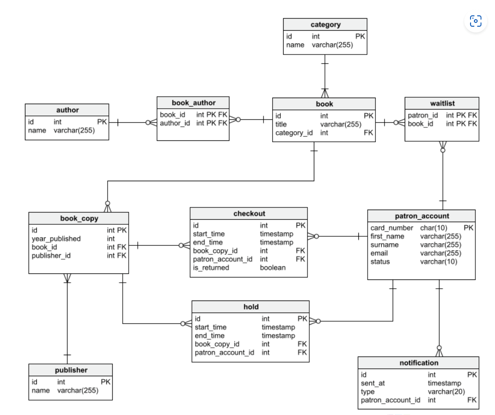

# Description

**Đề tài mini project: Xây dựng ứng dụng quản lý thư viện.**

**+ Mô tả: Xây dựng ứng dụng Quản lý thư viện có các tính năng sau:**
  -	Tính năng quản lý danh mục sách ( book catalog), cho phép tìm kiếm theo tên, tác giả và thể loại của cuốn sách. Lưu ý rằng có thể có nhiều hơn một bản sao của mỗi cuốn sách và một cuốn sách thậm chí có thể được xuất bản bởi các nhà xuất bản khác nhau.
  -	Tính năng hủy kích hoạt tài khoản của người mượn sách nếu họ không trả lại sách sau một khoảng thời gian cụ thể.
  -	Hồ sơ  lịch sử về những cuốn sách mà người thuê đã mượn cũng như đặt trước ( đặt trước là trạng thái cho phép người thuê đặt trước sách và đến lấy sau).
  -	Thông báo khi cuốn sách mong muốn có sẵn và nhắc nhở về việc đến lịch trả lại sách cho thư viện, cả hai đều qua email.

**+ Công nghệ sử dụng:**

-	Database: Postgresql
-	Triển khai docker.
-	Memcache: redis

**Cấu trúc thiết kế bảng:**

**+ Giải thích cấu trúc**

Thank for watch